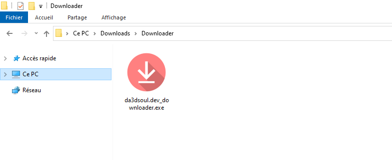
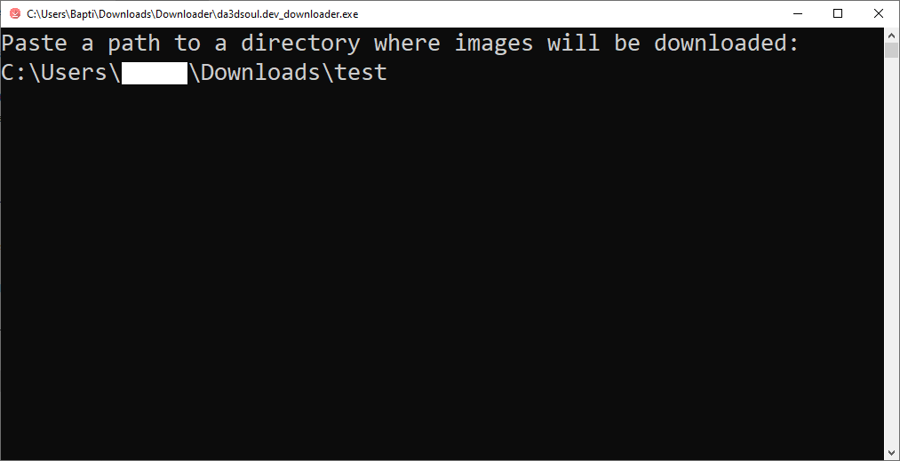

# Da3dsoul.dev Downloader

    

**Da3dsoul.dev Downloader** is an executable that download all image from the first to the latest from Da3dsoul.dev.

No GUi, full automatic

## Download

- 🟢 **[Latest release](https://github.com/Pietot/Da3dsoul.dev-Downloader/releases/latest)**

## How to use

Once you have downloaded the executable, follow these steps:

- Move the .exe to his own directory (optional but recommended)

- Run the .exe and do what's written

> **Note**: For the download path, use an empty folder or you will get this error :
> "number_subfile = int(nat.natsorted(sub_files)[-1].split('#')[-1])" and program will crash

- That's all ! Images will start downloading and no need to do these steps next time you launch it, it will directly download image

**WARNING !** : Do not modify Log.txt or settings.json if you don't know what you are doing

## Q&A

- How can I change the directory ?

Open settings.json in the folder you placed the .exe and change current path by the new path

> **Note**: It's also recommended to move all Packs from the old directory to the new directory